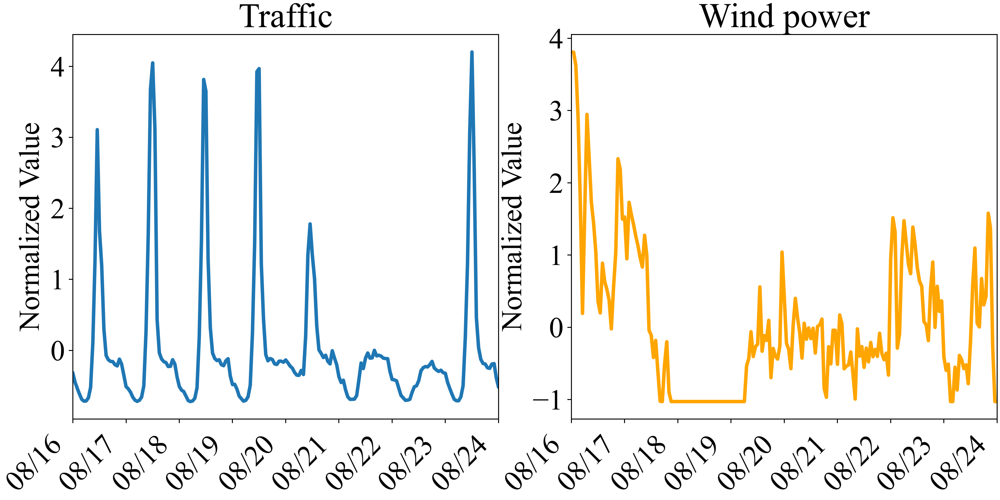
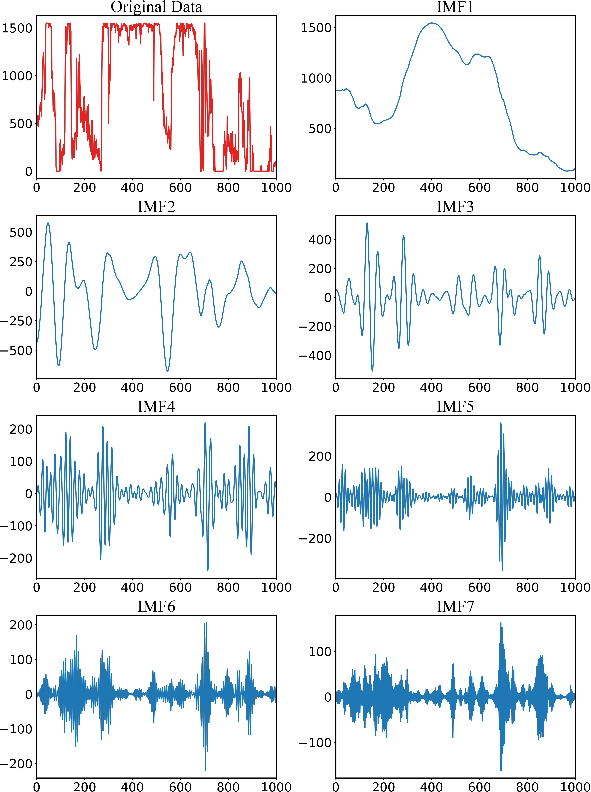
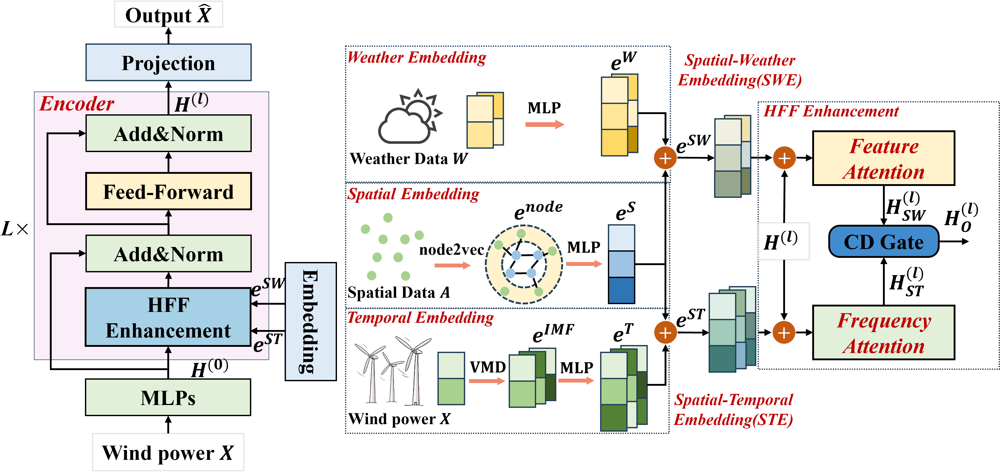
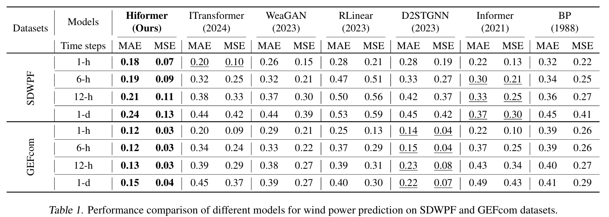
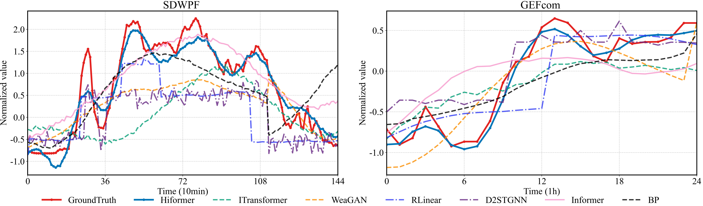

# Hiformer: Hybrid Frequency Feature Enhancement Inverted Transformer for Wind Power Prediction
# Introduction
Unlike traditional power station, the output of wind power plants is highly dependent on weather parameters such as wind speed, wind direction and temperature. This dependence introduces significant volatility and intermittency in wind power production, making grid systems highly fragile and challenging to manage
<p align="center">
  
</p>

# Overall Architecture
Due to the significant uncertainty and volatility of wind power, addressing it directly is a challenge. Therefore, we employ Variational Mode Decomposition (VMD) Module to process the wind power data. VMD is a signal decomposition technique that decomposes complex wind power signals into Intrinsic Mode Function (IMF).
<p align="center">
  
</p>
Hiformer introduces a unique structure that integrates signal decomposition technology with weather feature extraction technique to enhance the modeling of correlations between meteorological conditions and wind power generation. Additionally, Hiformer employs an encoder-only architecture, which reduces the computational complexity associated with wind power forecasting.
<p align="center">
  
</p>

# Usage
1.Install Pytorch and necessary dependencies
```bash
pip install -r requirements.txt
```
2.The datasets can be obtained from SDWPF and GEFcom2014
# Results of Long-Term Wind Power Prediction
## Performance comparison of different models for wind power prediction on SDWPF and GEFcom datasets.
We evaluate the Hiformer on two real-world datasets. Achieving best performance (MAE/MSE)

## Normalized forecasting results from Aug-7 to Aug-8 across the entire wind farm by all methods for (a) SDWPF dataset and (b) GEFcom dataset

## Computational time
By desiging the proposed framework, Hiformer achieves significant performance improvement in computational time
<p align="center">
  
</p>

##  Ablation Study
To evaluate the contribution of each key module in the Hiformer model, we conduct an ablation study using the SDWPF and GEFcom datasets. The experimental results provide insights into the role of each module in enhancing model performance. 
<p align="center">
  
</p>
